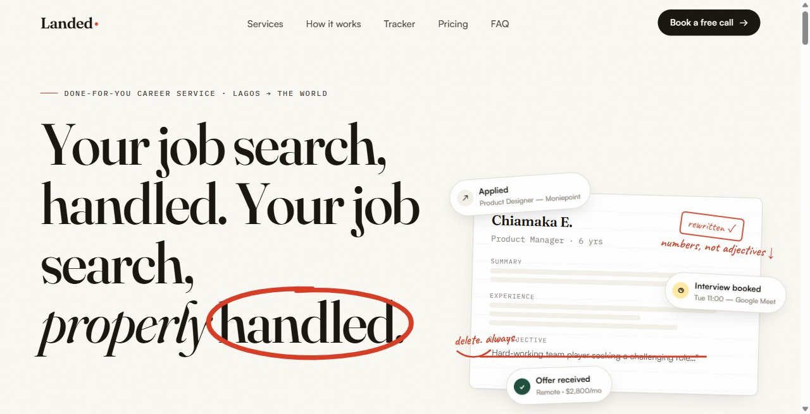

# Landed

A responsive landing page for a career service offering CV rewriting, job applications, and interview preparation.



## Features

- Service, process, application-tracker preview, pricing, and FAQ sections.
- NGN/USD pricing toggle and accessible FAQ accordions.
- Scroll reveals, animated counters, and smooth scrolling with reduced-motion support.
- Responsive desktop and mobile layouts.

## Run locally

From the project directory, run:

```sh
python -m http.server 4173 --bind 127.0.0.1
```

Open http://127.0.0.1:4173 in a browser. No package installation or build step is required.

## Deploy

Import this repository into Vercel, choose the **Other** framework preset, and serve the repository root. Leave the build command empty and use `.` as the output directory. Pushes to `main` deploy to production once the Git integration is connected.

## Structure and dependencies

`index.html` contains the page markup, styles, and JavaScript. `previews/` contains screenshots of the interface.

The page loads GSAP 3.12.5, ScrollTrigger, and Lenis 1.1.14 from jsDelivr; fonts from Google Fonts and Fontshare; and portrait images from Random User. These assets require an internet connection. System fonts and native scrolling provide partial fallbacks.

## Current scope

This is a frontend demonstration. Booking, WhatsApp, and several company/footer links are placeholders. The application tracker is a visual preview; there is no backend, payment processing, customer authentication, or scheduling integration. Service copy, prices, results, and testimonial identities are demo content and have not been verified as business claims.

No open-source license has been added; public visibility does not grant explicit reuse rights.
